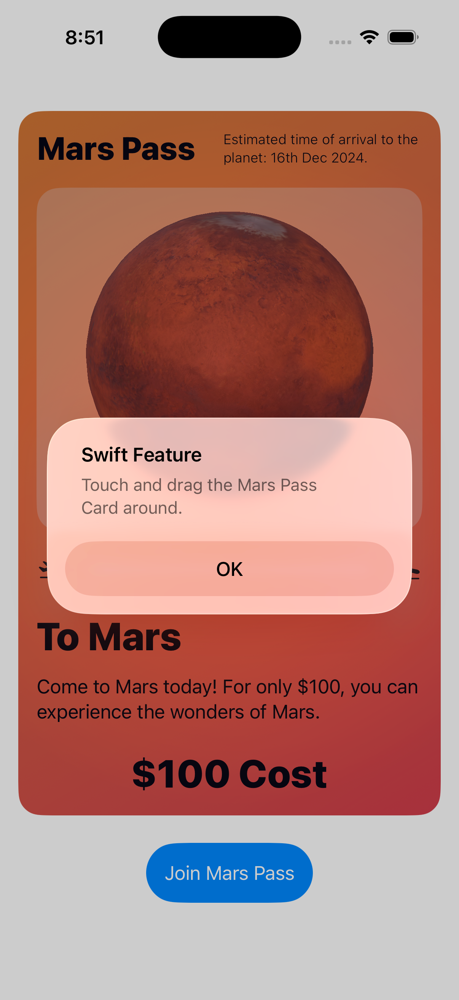
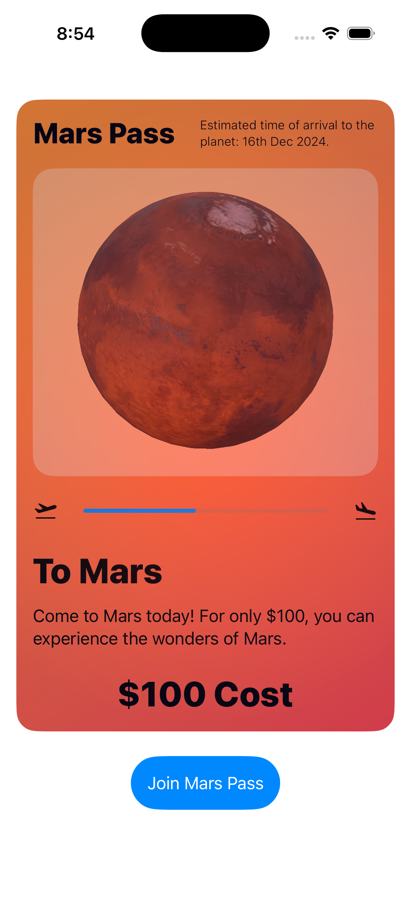

# 🚀 Mars Pass - Your Journey to the Red Planet

<p align="center">
  
</p>

<p align="center">
  <strong>Experience the future of space travel with Mars Pass - an interactive SwiftUI app that brings your Mars journey to life!</strong>
</p>

<p align="center">
  
  
  
  
</p>

## 🌟 Overview
I built this app to showcase what could be possible with creating a cool ticket system card that would have a 3D interactive element on it and be able to be moved around and looked at by the user.

### ✨ Key Features

- **🌍 Interactive 3D Mars Model**: Powered by SceneKit with realistic Mars textures and animations
- **🎫 Dynamic Ticket Interface**: Beautiful gradient-styled Mars Pass with interactive drag gestures
- **📱 Modern SwiftUI Design**: Clean, intuitive interface following Apple's Human Interface Guidelines
- **⏰ Journey Progress Tracking**: Real-time progress bar showing your journey to Mars
- **🎮 Touch Interactions**: Responsive 3D rotation and wobble effects
- **🧭 Navigation System**: Comprehensive menu system for easy app navigation

## 📱 Screenshots

### 3D Mars Experience
<p align="center">
  
  
</p>

*Interactive 3D Mars model with realistic textures and smooth animations*

## 🎥 Demo Videos

[📹 Watch 3D Card](Assets/Video_1.mov)

[📹 Watch Menu Usecase](Assets/Video_2.mov)


## 🛠 Technical Implementation

### Architecture
- **SwiftUI**: Modern declarative UI framework
- **SceneKit**: 3D graphics and animations
- **UIViewRepresentable**: Bridge between SwiftUI and UIKit/SceneKit
- **USDZ Models**: High-quality 3D Mars model integration

### Key Components

#### 🌍 MarsPlanetView
```swift
struct MarsPlanetView: UIViewRepresentable {
    // SceneKit integration for 3D Mars visualization
    // Automatic lighting and camera controls
    // USDZ model loading and animation
}
```

#### 🎫 SceneKit (Main View)
```swift
struct SceneKit: View {
    // Interactive ticket interface
    // Gesture handling for 3D rotations
    // Progress tracking and animations
}
```

#### 🏠 Navigation System
```swift
// HomeView: Main navigation hub
// SettingsView: Comprehensive menu system
// DetailView: Dynamic content presentation
```

## 🚀 Getting Started

### Prerequisites
- Xcode 15.0+
- iOS 17.0+
- Swift 5.9+

## 🎨 Customization

### Modifying Mars Appearance
```swift
// In MarsPlanetView.createScene()
customNode.scale = SCNVector3(15, 15, 15) // Adjust Mars size
let rotateAction = SCNAction.rotateBy(x: 5, y: 2 * .pi, z: 0, duration: 50) // Rotation speed
```

### Changing Journey Timeline
```swift
// In yearProgress() function
let startOfNextYear = dateFormatter.date(from: "2027-12-16")! // Modify arrival date
```

### Customizing Colors
```swift
// Mars-themed gradient colors
.orange // Primary Mars color
.orangeMars // Custom Mars orange
Color(red: 0.9, green: 0.2, blue: 0.2) // Mars surface red
```

## 📄 License

This project is licensed under the MIT License - see the [LICENSE](LICENSE) file for details.
